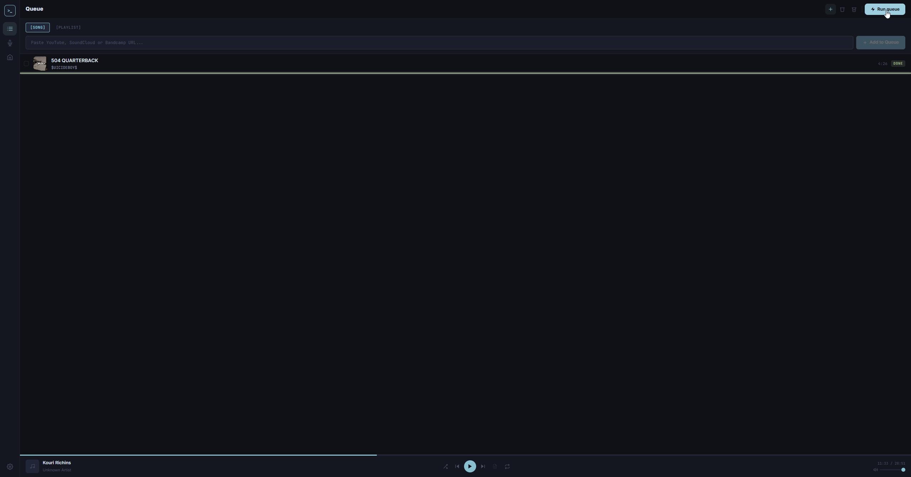
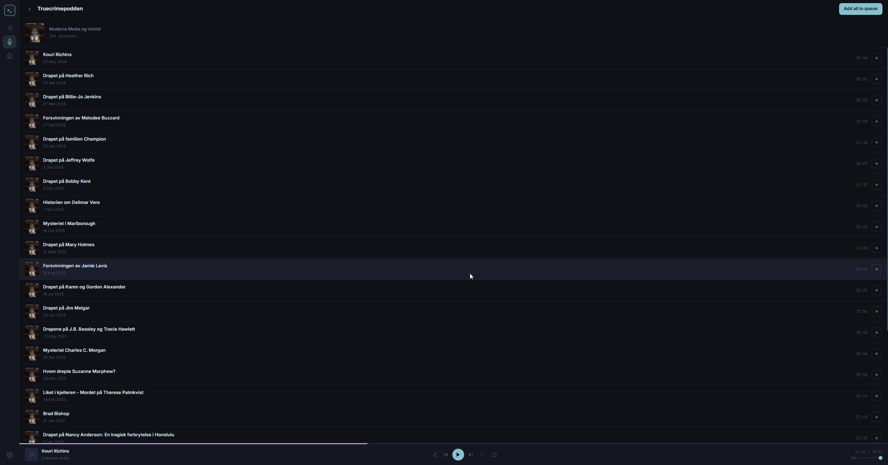

<div align="center">

# 〉_ nyro

**A clean, fast desktop app for downloading music and podcasts — built for people who actually own their listening.**

[](https://github.com/mariusberget92/nyro/releases)
[](https://github.com/mariusberget92/nyro/releases)
[](LICENSE)

<br />

<!-- Drop your own screenshots into docs/ and update these paths -->


</div>

---

## ✨ Features

### 🎵 Download anything
- **YouTube**, YouTube Music, **SoundCloud**, **Bandcamp**, **Vimeo**
- Output as **MP3** (64–448 kbps, you pick) or **MP4** (4K / 1080p / 720p / 480p)
- Titles, artists and album art are parsed automatically from video metadata
- Numbered filename prefixes with configurable templates (`{000} - `, `EP{00} - `, etc.)

### 📋 Smart queue
- Paste a single URL or an entire **playlist** — Nyro expands it automatically
- Playlists are saved into their own named folder
- Retry failed downloads, open the source URL, or get a plain-English explanation of what went wrong
- Queue state persists across restarts

### 🎙️ Podcast browser
- Powered by the **Taddy GraphQL API** — search, browse episodes, add to queue in one click
- Podcast episodes are organised into their own `Podcasts / Show Name /` folder
- Responses are cached for 6 hours to stretch the free-tier request limit

### 📚 Media library
- Scans your output folder on demand, reads **ID3 tags**, extracts cover art
- Browse by **Albums**, **Artists**, **Podcasts**, or flat track/video lists
- Scan results are persisted to disk — the library is available instantly on next launch

### 🎧 Mini player
- Built-in audio player with **shuffle**, **repeat**, **repeat one**
- Scrub bar with click-to-seek
- **Synced lyrics** — fetched automatically from [lrclib.net](https://lrclib.net) and saved as `.lrc` sidecars, displayed karaoke-style in the player

### 🔐 Cookie authentication
- **Method A (recommended):** import a `cookies.txt` file exported from your browser — works while Chrome is open
- **Method B:** read cookies directly from a live browser profile (Chrome must be fully closed)

### 🔄 Auto-updating yt-dlp
- Checks the GitHub releases API at startup and silently updates the `yt-dlp` binary if a newer version is available

---

## 📸 Screenshots

| Queue | Library | Podcasts |
|-------|---------|----------|
|  |  |  |

| Mini Player | Settings |
|-------------|----------|
|  |  |

> 💡 Add your screenshots to a `docs/` folder and update the paths above.

---

## 🚀 Installation

### Download a pre-built release *(recommended)*

Head to the [**Releases**](https://github.com/mariusberget92/nyro/releases) page and grab the file for your OS:

| Platform | File | Notes |
|----------|------|-------|
| 🪟 Windows | `Nyro-Setup-x.x.x.exe` | Standard installer |
| 🪟 Windows | `Nyro-x.x.x-portable.exe` | No install needed |
| 🍎 macOS | `Nyro-x.x.x.dmg` | Drag to Applications |

> **macOS first-launch note:** Because the app isn't yet notarised with an Apple Developer certificate, macOS will block it on first open. Right-click (or Ctrl-click) the app → **Open** → **Open** again to allow it. You only need to do this once.

---

## 🛠️ Building from source

**Prerequisites:** Node.js 20+, npm

```bash
# Clone the repo
git clone https://github.com/mariusberget92/nyro.git
cd nyro

# Install dependencies
npm install

# Start in development mode
npm run dev

# Build a release for your current OS
npm run build
```

Installer output lands in `dist/`.

### 📦 Required binaries

Nyro shells out to **yt-dlp** and **FFmpeg**. Place the binaries in the `resources/` folder before building:

```
resources/
├── yt-dlp          # or yt-dlp.exe on Windows
└── ffmpeg          # or ffmpeg.exe on Windows
```

| Binary | Download |
|--------|----------|
| yt-dlp | [github.com/yt-dlp/yt-dlp/releases](https://github.com/yt-dlp/yt-dlp/releases) |
| FFmpeg | [ffmpeg.org/download.html](https://ffmpeg.org/download.html) |

> yt-dlp is **auto-updated at startup** — you only need to seed it once.

---

## ⚙️ Configuration

All settings live in **Settings** (cog icon in the sidebar). Nothing is stored in the repo — credentials are saved to your OS app-data folder.

### 🎙️ Taddy API key *(for Podcast browser)*

1. Sign up at [taddy.org/signup/developers](https://taddy.org/signup/developers)
2. Copy your **User ID** and **API Key** from the dashboard
3. Paste both into **Settings → Taddy API** and hit **Save**

The free tier gives 300 requests/month. Nyro caches responses for 6 hours to keep usage low.

### 🔐 YouTube cookie authentication *(for age-restricted or bot-challenged videos)*

**Method A — cookies.txt file (recommended)**
1. Install the [Get cookies.txt LOCALLY](https://chromewebstore.google.com/detail/get-cookiestxt-locally/cclelndahbckbenkjhflpdbgdldlbecc) Chrome extension
2. Navigate to [youtube.com](https://youtube.com) while logged in
3. Click the extension → **Export**
4. In Nyro: **Settings → YouTube Cookies → Method A → Browse** and select the file

**Method B — read from browser directly**
- Pick your browser in **Settings → YouTube Cookies → Method B**
- ⚠️ Chrome **must be fully closed** — it locks its cookie database while running

---

## 🗂️ Output folder structure

```
📁 Music/Nyro/
├── 📁 Albums/
│   └── 📁 Album Name (2024)/
│       ├── 001 - Artist – Track.mp3
│       └── 002 - Artist – Track.mp3
├── 📁 Playlists/
│   └── 📁 My Playlist/
│       ├── 001 - Artist – Song.mp3
│       └── 002 - Artist – Song.mp3
├── 📁 Podcasts/
│   └── 📁 Show Name/
│       └── Episode Title.mp3
└── Artist – Standalone Track.mp3
```

Lyrics (when available) are saved as `.lrc` sidecar files next to each audio file and displayed in the mini player.

---

## 🏗️ Tech stack

| Layer | Technology |
|-------|-----------|
| Shell | [Electron 35](https://www.electronjs.org/) |
| Frontend | [Vue 3](https://vuejs.org/) + [Pinia](https://pinia.vuejs.org/) + [Vue Router 4](https://router.vuejs.org/) |
| Build | [electron-vite](https://electron-vite.org/) + [Tailwind CSS](https://tailwindcss.com/) |
| Downloads | [yt-dlp](https://github.com/yt-dlp/yt-dlp/releases) + [FFmpeg](https://ffmpeg.org/) |
| Tag reading | [node-id3](https://github.com/Zazama/node-id3) |
| Lyrics | [lrclib.net](https://lrclib.net) API |
| Podcasts | [Taddy GraphQL API](https://taddy.org/developers/intro-to-taddy-graphql-api) |
| Settings | [electron-store](https://github.com/sindresorhus/electron-store) |

---

## 🤝 Contributing

PRs and issues are welcome. Please open an issue first for large changes so we can align on direction.

---

## ⚖️ Legal

Nyro is a tool for downloading content **you have the right to download**. Respect copyright law and the terms of service of the platforms you use. The authors are not responsible for how this software is used.

---

<div align="center">

Made with ☕ and too many late nights

</div>
